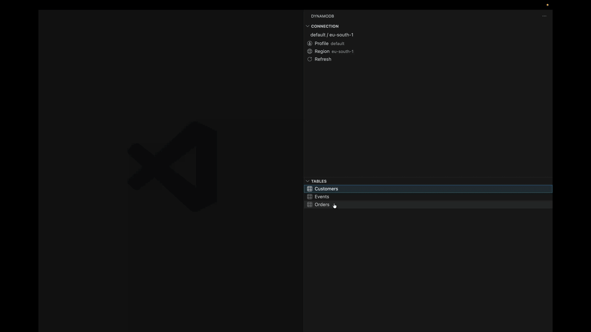
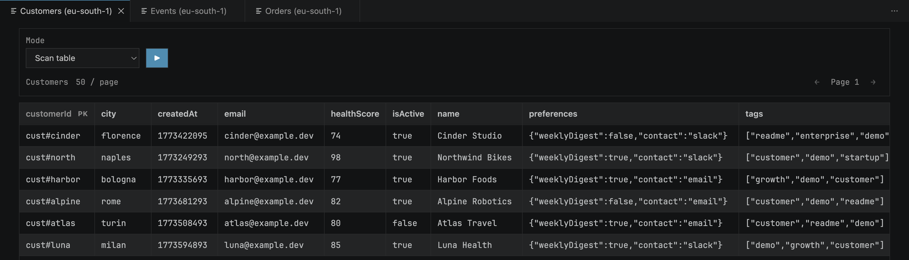

# DynamoDB Explorer for VS Code

DynamoDB Explorer gives you a fast and focused workspace inside VS Code so you can inspect tables, query data and make small fixes without leaving the project you are already working in.

Install from the [VS Code Marketplace](https://marketplace.visualstudio.com/items?itemName=riccardopll.vscode-dynamodb-explorer) or [Open VSX](https://open-vsx.org/extension/riccardopll/vscode-dynamodb-explorer).

## Features

- Browse tables directly from the sidebar
- Support for multiple AWS profiles and regions
- Run table scans and query global secondary indexes
- Edit item values inline and save them

## Configuration

| Type       | Name                           | Description                                                                                                    | Default                                         |
| ---------- | ------------------------------ | -------------------------------------------------------------------------------------------------------------- | ----------------------------------------------- |
| Setting    | `dynamodb.defaultRegion`       | Fallback AWS region when the selected profile does not define one.                                             | `us-east-1`                                     |
| Setting    | `dynamodb.pageSize`            | Maximum number of DynamoDB items to load per request.                                                          | `50`                                            |
| Keybinding | `DynamoDB: Save Table Changes` | Saves item edits while a DynamoDB table explorer is focused. You can remap it from VS Code Keyboard Shortcuts. | `Cmd+S` on macOS, `Ctrl+S` on Windows and Linux |
